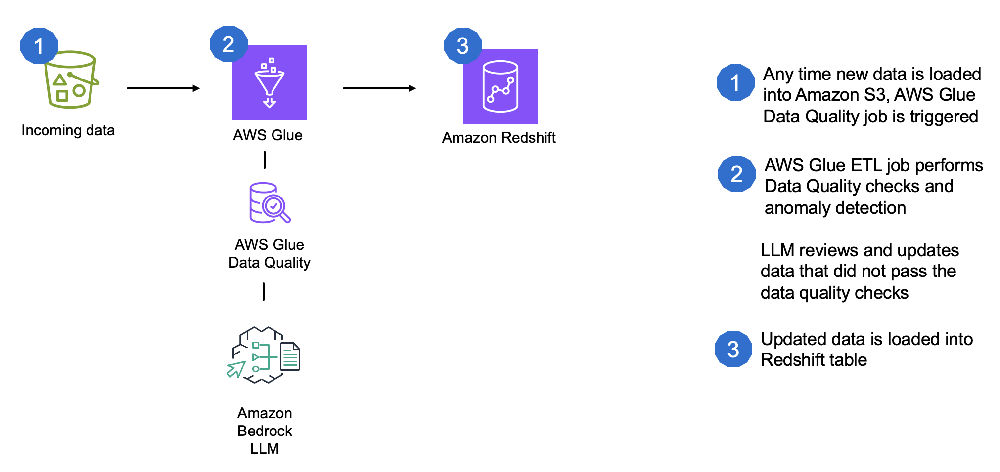

# ETL pipeline with data quality and anomaly detection and LLM auto-correction

## Solution Architecture


## Overview
This solution implements an automated data quality check and correction system using AWS services and Large Language Models (LLM). The architecture combines AWS Glue for ETL processing and Amazon Bedrock for LLM-based data correction, and Amazon Redshift for data storage.

## Key Components
1. AWS Glue ETL Job
   - Processes source data from S3
   - Performs data quality checks
   - Integrates with Amazon Bedrock for corrections

2. Amazon Bedrock
   - Provides LLM capabilities
   - Suggests corrections for identified issues

3. Amazon Redshift
   - Stores the processed and corrected data


## Prerequisites
- AWS Account with appropriate permissions
- Amazon Bedrock access
- AWS Glue service role with necessary permissions
- Redshift cluster and connection details

## Getting Started

1. Clone the repository:
   ```
   git clone https://github.com/fhuthmacher/data-quality-automation.git
   cd data-quality-automation
   ```

2. Set up a virtual environment:
   ```
   python -m venv venv
   source venv/bin/activate  # On Windows, use `venv\Scripts\activate`
   ```

3. Create dev.env file and populate with the appropriate values for the environment variables
   ```
    REGION=us-east-1
    SQL_DATABASE=REDSHIFT
    SQL_DIALECT=PostgreSQL
    DATABASE_SECRET_NAME=RedshiftCreds
    S3_BUCKET_NAME=XXX
    GLUE_IAM_ROLE_ARN=XXX
   ```

4. Set up Redshift connection in AWS Glue
5. Ensure you have sufficient permissions to access AWS Glue, Amazon Bedrock, and Amazon Redshift
6. Go through the notebooks and run them in the order they are listed.
7. Refer to the blog for further details.

## Repository Structure
- /01_dq-etl.ipynb: This notebook creates a table in Redshift, along with an AWS Glue ETL job that includes data quality checks and anomaly detection.
- /02_dq-etl with correction.ipynb: creates a new AWS Glue ETL job that includes LLM auto-correction.
- /03_create_custom_reusable_visual_transform.ipynb: This notebook creates a custom reusable visual transform that can be used in Glue Studio to fix data quality issues with the help of an LLM.
- /04_dq-llm-etl.ipynb: This notebook evaluates different prompt engineering techniques for LLM-based data quality checks.

## Authors

- Felix Huthmacher  - *Initial work* - [github](https://github.com/fhuthmacher)

## Security

See [CONTRIBUTING](CONTRIBUTING.md#security-issue-notifications) for more information.

## License

This library is licensed under the MIT-0 License. See the LICENSE file.